---

## ◆ About Me

Software Engineer focused on **Java and Spring Boot** backend development. I build REST APIs, database-backed applications, external API integrations, and data synchronization workflows.

Currently strengthening my backend engineering fundamentals through practical projects and postgraduate Computer Science study.

I use AI tools as a development aid—for debugging, exploring implementation approaches, understanding unfamiliar APIs, and technical research—while maintaining disciplined engineering practices.

---

## ◈ Core Stack

### **Languages**
`Java` • `Python` • `SQL` • `C`

### **Backend & Frameworks**
`Spring Boot` • `Spring Web` • `Spring Security` • `Spring Data JPA` • `Hibernate` • `REST APIs` • `JWT` • `BCrypt`

### **Persistence & Database**
`JPA` • `JDBC` • `Oracle SQL` • `Oracle Database`

### **API Development**
`Swagger/OpenAPI` • `Postman` • `MapStruct` • `DTOs` • `RestClient`

### **Infrastructure & Tools**
`Docker` • `Docker Compose` • `Redis` • `Git` • `GitHub` • `IntelliJ IDEA` • `Linux`

### **Build & Quality**
`Maven` • `JUnit` • `Mockito`

---

## ◇ Featured Backend Projects

### 🔌 [API Integration & Data Synchronization Assessment](https://github.com/FatmaElMahdi1000/API-integration-data-synchronization-Assessment-)

**Java · Spring Boot · REST API · Oracle · External API Integration**

A Spring Boot backend that integrates with an external Assessment API, synchronizes customer data into an internal Oracle database, and exposes the synchronized data through REST endpoints.

**Technical highlights:**
- RestClient integration with external REST API
- Data synchronization & reconciliation logic
- JPA/Hibernate entity mapping with MapStruct
- Pagination handling
- Oracle JDBC integration
- Swagger/OpenAPI documentation
- Docker containerization

---

### 🎯 [BuildersTribe Task Management API](https://github.com/FatmaElMahdi1000/BuildersTribe-ENGINEERING-CASE-STUDY)

**Java · Spring Boot · Spring Security · JWT · Oracle**

A backend task management system emphasizing authentication and user-scoped data access. Demonstrates proper Spring Security configuration, JWT token handling, and secure filtering without exposing other users' data.

**Technical highlights:**
- Spring Security authentication & authorization
- JWT token generation and validation
- User-scoped task filtering
- Spring Data JPA repositories
- REST API endpoints
- Swagger documentation

---

### 📚 [Bookstore Management System](https://github.com/FatmaElMahdi1000/Bookstore-Application-Full-Stack-Learning-Project)

**Java · Spring Boot · JPA · Oracle · REST APIs**

A backend bookstore system covering customer management, inventory, order processing, and cart operations. Emphasizes backend architecture and business logic.

**Technical highlights:**
- Spring Boot REST API layer
- Spring Data JPA with entity relationships (one-to-many, many-to-many)
- Oracle database schema design
- Transaction management
- Maven build configuration

---

### ✓ [Multi-User Task Management System](https://github.com/FatmaElMahdi1000/Multi-User_Task_Management_System_DeskTop_App)

**Java · Swing · Oracle · JDBC · Layered Architecture**

A desktop application prioritizing software architecture and OOP design over UI sophistication. Demonstrates layered architecture, DAO pattern, and proper database integration.

**Technical highlights:**
- Layered architecture (Presentation → Service → Data Access)
- DAO pattern for database abstraction
- User authentication & task isolation
- Prepared statements for SQL injection prevention
- Oracle JDBC integration

---

### 🤖 [Domain-Aware Machine Translation with LLM Post-Editing](https://github.com/FatmaElMahdi1000/Domain-MT-LLM-postediting-Paper-Research-Implementation-)

**Python · MarianMT · Hugging Face · PyTorch · Google GenAI**

Research implementation combining neural machine translation, terminology management, and LLM-assisted post-editing. Based on academic research in terminology-aware MT pipelines.

**Technical highlights:**
- MarianMT transformer models
- Terminology memory (TM) integration
- Google Generative AI for post-editing
- TBX export format
- Pandas data processing
- PyTorch model inference

---

## 🏗️ Backend Engineering Focus

```
Client Request
    ↓
REST Controller (HTTP Layer)
    ↓
DTO Validation & Mapping
    ↓
Service Layer (Business Logic)
    ↓
Repository Pattern (Data Access)
    ↓
JPA/Hibernate (ORM)
    ↓
Oracle Database
```

**Core principles I follow:**

- Separation of concerns (Controller → Service → Repository)
- DTOs for API boundaries
- MapStruct for object mapping
- Transaction boundaries at service layer
- Repository abstraction for database independence
- Proper exception handling and logging

---

## 🧪 Testing

- **Unit Testing:** JUnit with Mockito for service & repository layer testing
- **Isolation:** Mocking external dependencies and database calls
- **API Testing:** Postman for endpoint validation
- **Edge Cases:** Null handling, boundary conditions, concurrent access scenarios

---

## 📚 Currently Learning

- Advanced Java fundamentals
- Spring Boot best practices and patterns
- REST API design principles
- Spring Security configuration
- JPA/Hibernate advanced patterns
- Oracle SQL optimization
- Unit testing strategies with JUnit and Mockito
- Clean code and backend architecture

---

## 🧠 AI-Assisted Development

I use AI tools as a development aid for:

- Debugging runtime issues and stack traces
- Exploring implementation approaches
- Understanding unfamiliar APIs and frameworks
- Generating test ideas and test cases
- Refactoring discussions and code review
- Technical research and documentation

AI is a tool to enhance productivity, not a replacement for engineering discipline and problem-solving.

---

## ◆ GitHub Statistics


---

## ◇ Connect

- **GitHub:** [github.com/FatmaElMahdi1000](https://github.com/FatmaElMahdi1000)
- **LinkedIn:** [linkedin.com/in/fatma-el-mahdi-837a80177](https://www.linkedin.com/in/fatma-el-mahdi-837a80177/)

---

<div align="center">

**"The only true wisdom is in knowing you know nothing." — Socrates**

*A Software Engineer pursuing backend mastery.*


</div>